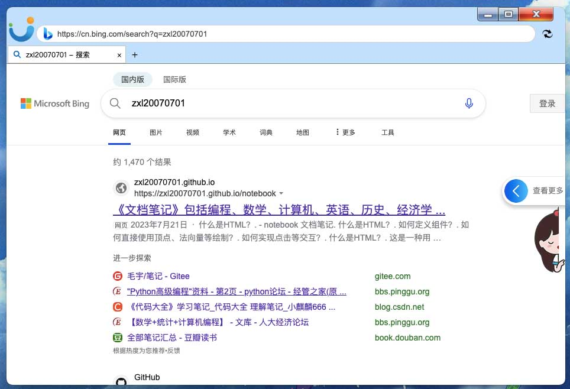
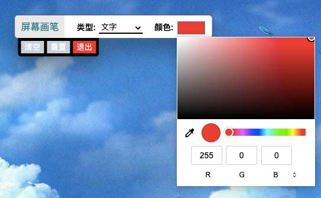
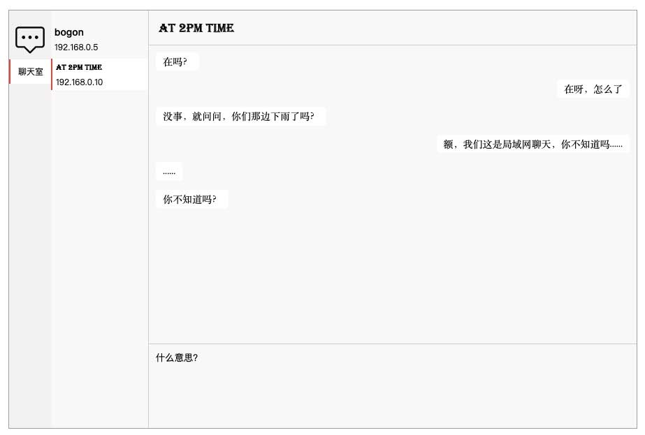

# [Easy Browser](https://github.com/oi-contrib/Easy-Browser)
一个简单的定制化浏览器

## 如何开发？

确定node.js已经安装好了以后，直接执行下面目录安装依赖：

```js
npm install
```

然后，执行下面的命令即可启动开发：

```js
npm run dev
```

开发完毕，需要打包发布，直接：

```js
npm run build
```

打包后的安装包位于 release 中。

## 包含的功能

首先，是基础的浏览器功能：



目前包含基础的网页访问、页签、页面音频管理等，当然，我们会迭代完善。

除此之外，还提供了一些好用的工具，下面是部分功能截图：

### 屏幕画笔

你可以在你的屏幕上使用画笔涂抹和编辑文字，这对于日常交流的时候说明非常有用：



### 局域网聊天工具

如果你们在同一个局域网上，同时打开聊天界面，就可以自动成为好友然后聊天了：



最后，欢迎给我们[留言](https://github.com/oi-contrib/Easy-Browser/issues)提建议，我们将逐步优化和丰富功能。

## 版权

MIT License

Copyright (c) [zxl20070701](https://zxl20070701.github.io/notebook/home.html) 走一步，再走一步